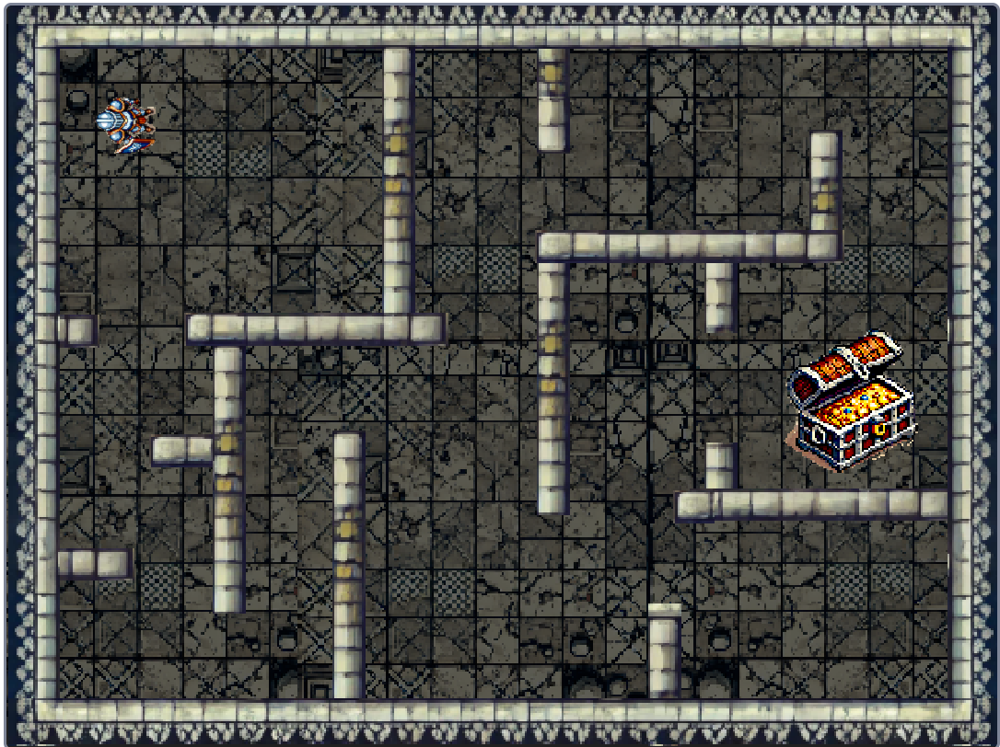

# The maze game

Here you will find the resources to make a maze game in scratch: the 
typical warrior (male and female), the walls of the maze and the floor.

There is a treasure chest also to use it as a reward if you have 
finished the game. 

With that elements, your alumni can implement the typical game 
of "find the treasure": if you bump with the maze walls, you lost. 

